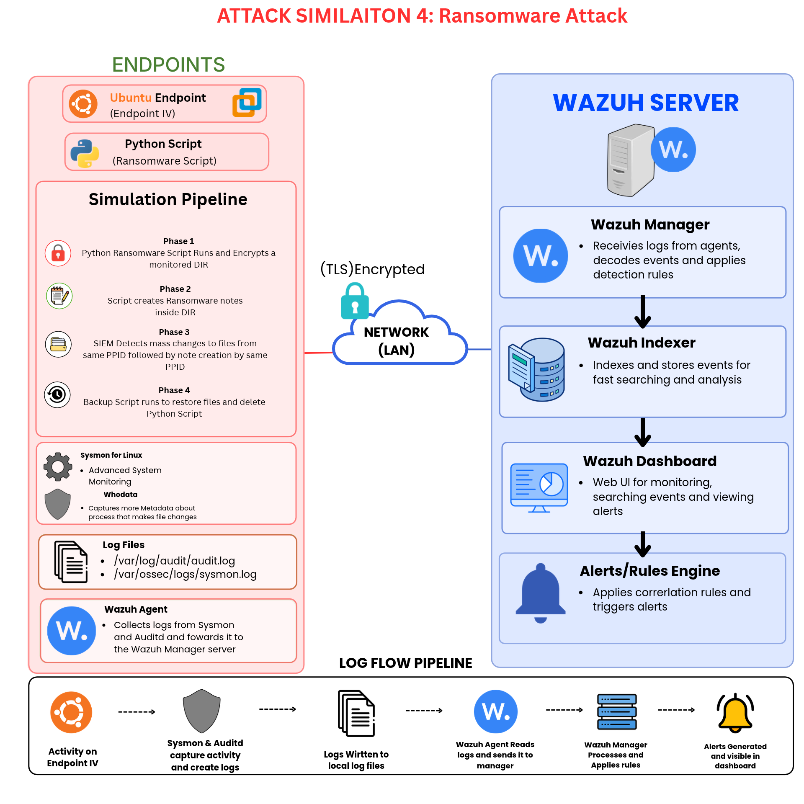

# 🦠 Ransomware Attack Simulation

<p align="center">
  
</p>


> **A defensive ransomware simulation and detection-engineering project using Wazuh SIEM**


---

## 📅 Project Information

| Category | Details |
|---|---|
| **Date** | September 18, 2026 |
| **Platform** | Wazuh SIEM |
| **Attack Type** | Ransomware / Mass File Encryption |
| **MITRE ATT&CK** | `T1486 — Data Encrypted for Impact` |
| **Programming Language** | Python |
| **Environment** | Isolated Home SIEM Lab |
| **Primary Focus** | Detection Engineering & Incident Response |

---

## 📌 Overview

This project demonstrates a **ransomware attack-vector simulation** inside my Wazuh SIEM lab.

The simulation uses a Python script to perform **bulk file encryption** against a monitored directory. The activity generates a large number of file modifications in a short period of time, followed by the creation of a ransomware-style notification file.

The Wazuh detection pipeline correlates these events to identify behavior consistent with ransomware activity.

Once the final detection rule is triggered, a response workflow can be initiated to **restore the affected files from a backup source**.

> ⚠️ **Lab Simulation:** This project was performed in an isolated home SIEM environment for defensive security testing and detection engineering. The ransomware component is intended to reproduce observable attack behavior for detection testing rather than function as real-world malware.

---

# 🎯 Project Objectives

The primary objective of this project was to demonstrate how a SIEM can detect ransomware based on **behavioral indicators** rather than relying solely on a known malware signature.

The detection pipeline focuses on:

- 🔄 Rapid modification of multiple files
- 🧩 Multiple file changes originating from the same process
- 📝 Creation of ransomware-style notification files
- 🔗 Correlation across multiple Wazuh rules
- 🎯 MITRE ATT&CK technique mapping
- 💾 Backup and recovery
- 🚨 Detection → Response → Recovery workflow

---

# 🔄 Detection Pipeline

The detection logic follows a multi-stage behavioral correlation process:

```text
                    ┌─────────────────────────┐
                    │   File Modification     │
                    │         Events          │
                    └────────────┬────────────┘
                                 │
                                 ▼
                    ┌─────────────────────────┐
                    │       Rule 550          │
                    │    File Change Event    │
                    └────────────┬────────────┘
                                 │
                                 │ Same PPID
                                 │ 10 events
                                 │ Within 2 sec
                                 ▼
                    ┌─────────────────────────┐
                    │      Rule 100234        │
                    │   Possible Mass         │
                    │   Encryption Detected   │
                    └────────────┬────────────┘
                                 │
                                 │ Within 5 sec
                                 ▼
                    ┌─────────────────────────┐
                    │      Rule 100235        │
                    │   Ransomware Detected   │
                    └────────────┬────────────┘
                                 │
                                 ▼
                    ┌─────────────────────────┐
                    │    Backup / Recovery    │
                    │    Workflow Initiated   │
                    └─────────────────────────┘
```

---

## 🧠 Detection Logic

The pipeline is designed to reduce false positives by correlating **multiple behavioral indicators**.

### Stage 1 — Mass File Modification

If the **same PPID** is responsible for at least **10 file-change events within 2 seconds**, Wazuh generates a high-severity alert indicating possible mass encryption.

### Stage 2 — Ransomware Note Detection

If the mass-encryption rule fires and a file matching one of the monitored extensions is subsequently created within **5 seconds**, the second rule triggers the final ransomware detection.

Monitored extensions include:

```text
.md
.txt
.html
.htm
.png
.jpg
```

This combination provides stronger evidence than detecting either behavior independently.

---

# 🛡️ Wazuh Detection Rules

## Rule `100234` — Possible Mass Encryption

```xml
<!-- Ransomwhere Attack -->
<group name="Ransomwhere Attack">

  <rule id="100234" level="15" frequency="10" timeframe="2">
    <if_matched_sid>550</if_matched_sid>
    <same_field>ppid</same_field>

    <description>Possible Mass Encryption Detected</description>

    <mitre>
      <id>T1486</id>
    </mitre>

    <group>ransomware,</group>
  </rule>
```

### What it detects

Rule `100234` looks for a rapid sequence of file-change events associated with the **same PPID**.

| Condition | Value |
|---|---:|
| Base Rule | `550` |
| Required Events | `10` |
| Time Window | `2 seconds` |
| Correlation Field | `PPID` |
| Severity | `15` |
| MITRE ATT&CK | `T1486` |

This provides the first indication that a single process may be performing mass file modifications.

---

## Rule `100235` — Ransomware Detected

```xml
<rule id="100235" level="16" timeframe="5">

  <if_matched_sid>100234</if_matched_sid>
  <if_sid>554</if_sid>

  <field name="file" type="pcre2">
    (?i)\.(md|txt|html|htm|png|jpg)$
  </field>

  <description>
    Ransomwhere Detected. Run Backup Scripts!...
  </description>

</rule>

</group>
```

### What it detects

Rule `100235` acts as the **final correlation rule**.

It requires:

1. Rule `100234` to have already triggered.
2. A file-change event associated with Rule `554`.
3. The affected file to match one of the monitored extensions.
4. The event to occur within the configured `5-second` timeframe.

When these conditions are met, Wazuh raises a **Level 16 ransomware detection**.

---

# 🧠 Why Correlate Multiple Events?

Detecting a single modified file is not enough to confidently identify ransomware.

Legitimate applications constantly modify files. Text editors, image editors, compilers, browsers, and software updaters can all generate file-change events.

Instead, this project looks for a **sequence of behaviors**:

```text
Single File Change
       │
       ▼
Normal Activity
       │
       │
       ▼
10+ File Changes
Same PPID
Within 2 Seconds
       │
       ▼
Possible Mass Encryption
       │
       ▼
Ransomware-Style File Created
       │
       ▼
Ransomware Detected
```

The correlation between these events provides a stronger behavioral signal for ransomware activity.

---

# 🧪 Attack Simulation

The simulation uses a Python script to perform **bulk encryption** against files inside a monitored directory.

The simulated attack demonstrates:

- 🐍 Python-based encryption
- 🔐 AES-GCM encryption
- 📁 Bulk file processing
- 🔑 Symmetric encryption
- 🔄 File modification at scale
- 📝 Ransomware-note creation
- 📊 SIEM event generation
- 🛡️ Wazuh rule correlation

The objective is not to create real-world malware, but to reproduce the **observable behaviors** that a defensive security system should be capable of detecting.

---

# 💾 Recovery Workflow

After the ransomware detection is triggered, a recovery workflow can be initiated to restore the affected files from a backup source.

For this project, the recovery workflow uses **Google Drive** as the backup location.

```text
Ransomware Detection
        │
        ▼
   Wazuh Alert
        │
        ▼
  Recovery Script
        │
        ▼
 Google Drive Backup
        │
        ▼
   Restore Files
        │
        ▼
Working Directory Recovered
```

This demonstrates how SIEM detection can be connected to a broader **incident-response and recovery workflow**.

---

# 🧰 Technologies & Concepts

## 🛡️ SIEM & Detection

- **Wazuh**
- Wazuh custom rules
- Event correlation
- File Integrity Monitoring
- Behavioral detection
- MITRE ATT&CK mapping

## 🐍 Programming

- **Python**
- File automation
- Encryption libraries
- Backup/recovery scripting

## 🔐 Cryptography

- **AES-GCM**
- Symmetric encryption
- Encryption at scale

## 🚨 Incident Response

- Ransomware detection
- Automated response
- Backup restoration
- File recovery
- Detection → Response → Recovery workflow

---

# 🧠 What I Learned

Through this simulation, I gained practical experience with:

- Designing behavioral SIEM detections
- Creating custom Wazuh rules
- Correlating multiple security events
- Using process information such as PPIDs for detection
- Mapping detections to **MITRE ATT&CK**
- Writing Python security automation scripts
- Understanding AES-GCM encryption
- Understanding symmetric encryption
- Simulating bulk file encryption
- Building a basic ransomware response workflow
- Connecting detection with backup and recovery

---

# 🔧 Areas for Improvement

There are several areas I would improve in a future version of this project.

## 1. 🤖 Automated Response with SOAR

I could integrate a **SOAR platform** or open-source automation tooling to automatically respond to the alert.

A future workflow could:

```text
Ransomware Detected
        ↓
Isolate Endpoint
        ↓
Terminate Malicious Process
        ↓
Preserve Evidence
        ↓
Restore Files
        ↓
Generate Incident Report
```

This would provide a more complete **detection → containment → recovery** workflow.

---

## 2. 📸 Snapshot-Based Recovery

Another improvement would be implementing **snapshot-based restoration**.

Instead of relying solely on a backup copy, filesystem or virtual-machine snapshots could provide a faster method of reverting affected files to a known-good state.

This would also allow me to investigate how snapshot-based recovery can be incorporated into ransomware response procedures.

---

## 3. 🔍 Persistence Removal

A future version of the project could also investigate how to identify and remove potential **persistence mechanisms** following a ransomware incident.

This would expand the project beyond simply detecting encryption activity and into the broader incident-response lifecycle.

---

# 📚 MITRE ATT&CK Mapping

| Technique | ID | Relevance |
|---|---|---|
| Data Encrypted for Impact | **T1486** | Simulated ransomware encrypts files to demonstrate encryption-for-impact behavior |

### MITRE ATT&CK

`T1486 — Data Encrypted for Impact`

---

# 📊 Project Workflow

Overall, the project demonstrates the following security workflow:

```text
┌───────────────┐
│     Attack    │
│   Simulation  │
└───────┬───────┘
        │
        ▼
┌───────────────┐
│ File Changes  │
│   Generated   │
└───────┬───────┘
        │
        ▼
┌───────────────┐
│   Wazuh FIM   │
│     Events    │
└───────┬───────┘
        │
        ▼
┌───────────────┐
│  Rule 100234  │
│ Mass Changes  │
└───────┬───────┘
        │
        ▼
┌───────────────┐
│  Ransomware   │
│  Note Created │
└───────┬───────┘
        │
        ▼
┌───────────────┐
│  Rule 100235  │
│   Detection   │
└───────┬───────┘
        │
        ▼
┌───────────────┐
│    Recovery   │
│    Workflow   │
└───────────────┘
```

---

# 🚀 Future Improvements

- [ ] Integrate SOAR automation
- [ ] Automatically isolate the affected endpoint
- [ ] Automatically terminate the responsible process
- [ ] Implement snapshot-based recovery
- [ ] Improve ransomware-note detection
- [ ] Expand file-extension detection
- [ ] Add additional MITRE ATT&CK mappings
- [ ] Improve false-positive resistance
- [ ] Add automated incident reporting
- [ ] Investigate persistence detection and removal

---

# 📸 Evidence & Project Structure

The ransomware simulation is organized into separate directories for **screenshots, scripts, detection rules, and demonstration footage**.

```text
Ransomware/
│
├── 📸 screenshots/
│   ├── Backup Script Running.png
│   ├── Bulk File Changes Detected by SIEM.png
│   ├── Files back in Plaintext.png
│   ├── Files in DIR now Encrypted.png
│   ├── Files in DIR in plaintext before Ransomware Script.png
│   ├── Files of DIR before.png
│   ├── Pipeline for Rules Working .png
│   ├── Ransomware Note Made.png
│   ├── Ransomware Script Encrypted Contents.png
│   └── Running Ransomware Script.png
│
├── 🐍 Scripts/
│   ├── Mock_data.py
│   │   └── Creates mock file-change data for testing
│   │
│   ├── Ransomware Script.py
│   │   └── Simulates the ransomware attack
│   │
│   └── RestoreBackup.py
│       └── Restores affected files from backup
│
├── 🛡️ Rules/
│   └── Ransomwhere Attack.xml
│       └── Wazuh detection rules used for
│           the ransomware attack simulation
│
└── 🎥 Video/
    └── Demo.mp4
        └── Demonstrates the complete detection
            and response pipeline
```

---

## 📂 Directory Overview

| Directory | Purpose |
|---|---|
| 📸 `screenshots/` | Visual evidence of the ransomware simulation and Wazuh detection pipeline |
| 🐍 `Scripts/` | Python scripts used to generate, simulate, and recover from the attack |
| 🛡️ `Rules/` | Custom Wazuh rules used to detect the simulated ransomware activity |
| 🎥 `Video/` | Demonstration of the complete attack and detection pipeline |

---

# 📸 Screenshot Evidence

The following screenshots document the simulation from **pre-attack preparation → encryption → detection → recovery**.

---

## 1. 💾 Backup Script Running

**`Backup Script Running.png`**

Shows the backup script actively running before the ransomware simulation. The script creates backups of the files that will later be affected by the simulated attack.


---

## 2. 📁 Files Before the Attack

**`Files of DIR before.png`**

Shows the contents of the target directory **before** the ransomware simulation begins. The files are still in their original, readable state.


---

## 3. 📄 Plaintext Files Before Ransomware

**`Files in DIR in plaintext before Ransomware Script.png`**

Provides a closer view of the target files while they are still stored as normal plaintext files immediately before the ransomware script is executed.


---

## 4. 🐍 Ransomware Simulation Running

**`Running Ransomware Script.png`**

Shows the ransomware simulation script being executed against the test directory.

This represents the **attack simulation phase** of the project.


---

## 5. 🔐 Files Being Encrypted

**`Ransomware Script Encrypted Contents.png`**

Shows the ransomware simulation processing the files and encrypting their contents.

This demonstrates the simulated impact of the attack on the test data.


---

## 6. 🔒 Directory After Encryption

**`Files in DIR now Encrypted.png`**

Shows the target directory after the ransomware simulation has completed.

The previously readable files are now represented in their encrypted state.


---

## 7. 📝 Ransomware Note Created

**`Ransomware Note Made.png`**

Shows the ransom note generated by the simulation after the files have been encrypted.

This represents the notification behavior commonly associated with ransomware and provides an additional detection indicator for the SIEM.


---

## 8. 🛡️ Wazuh Detection Pipeline

**`Pipeline for Rules Working .png`**

Shows the Wazuh detection pipeline processing the simulated ransomware activity.

This demonstrates the custom security rules being triggered and the detection pipeline functioning as designed.


---

## 9. 🚨 Bulk File Changes Detected by SIEM

**`Bulk File Changes Detected by SIEM.png`**

Shows the SIEM detecting the large number of file changes generated by the ransomware simulation.

The rapid modification activity serves as an indicator of potentially malicious behavior.


---

## 10. ♻️ Files Restored

**`Files back in Plaintext.png`**

Shows the files after the recovery process has restored them to their original readable state.

This demonstrates the **final recovery stage** of the simulation.


---

# 🔄 Complete Simulation Timeline

The screenshots collectively demonstrate the complete lifecycle of the lab:

```text
┌──────────────────────┐
│   💾 Backup Created  │
└──────────┬───────────┘
           ↓
┌──────────────────────┐
│ 📁 Files in Original │
│       State          │
└──────────┬───────────┘
           ↓
┌──────────────────────┐
│ 🐍 Ransomware        │
│    Simulation        │
│      Executed        │
└──────────┬───────────┘
           ↓
┌──────────────────────┐
│ 🔐 Files Encrypted   │
└──────────┬───────────┘
           ↓
┌──────────────────────┐
│ 📝 Ransomware Note   │
│       Created        │
└──────────┬───────────┘
           ↓
┌──────────────────────┐
│ 🚨 SIEM Detects      │
│  Bulk File Changes   │
└──────────┬───────────┘
           ↓
┌──────────────────────┐
│ 🛡️ Wazuh Rules       │
│      Correlate       │
│       Events         │
└──────────┬───────────┘
           ↓
┌──────────────────────┐
│ ♻️ Recovery Workflow │
│      Initiated       │
└──────────┬───────────┘
           ↓
┌──────────────────────┐
│ 📄 Files Restored    │
│    to Plaintext      │
└──────────────────────┘
```

---

# 🐍 Scripts

### `Mock_data.py`

Generates mock file-change data used to test the Wazuh detection pipeline.

### `Ransomware Script.py`

Simulates bulk file encryption and ransomware-style activity inside the controlled lab environment.

### `RestoreBackup.py`

Restores the affected files from the backup source after the simulated ransomware event.

---

# 🛡️ Detection Rules

### `Ransomwhere Attack.xml`

Contains the custom Wazuh rules used to correlate file-change activity and identify the simulated ransomware behavior.

The primary detection rules are:

| Rule | Purpose | Level |
|---|---|---:|
| `550` | Base file-change event | — |
| `100234` | Possible mass encryption | `15` |
| `100235` | Ransomware detection | `16` |

---

# 🎥 Demonstration

### `Demo.mp4`

The demonstration video shows the complete ransomware simulation pipeline, including:

```text
Attack Simulation
       ↓
File Encryption
       ↓
Ransomware Note
       ↓
Wazuh Detection
       ↓
Rule Correlation
       ↓
Recovery
       ↓
Files Restored
```

---

# 🏁 Conclusion

This project demonstrates how a SIEM can detect ransomware-like behavior by correlating **rapid file modifications, process relationships, and ransomware-note creation**.

Rather than relying on a single indicator, the detection pipeline uses multiple events to increase confidence that the activity represents potential ransomware behavior.

The project also demonstrates the importance of connecting **detection with response and recovery**, creating a workflow that extends beyond simply generating a SIEM alert.

> **Attack Simulation → Detection → Correlation → Response → Recovery**

This project forms part of my broader **Wazuh Home SIEM Lab**, where I am building and testing practical security monitoring, detection engineering, attack simulation, and incident-response capabilities.