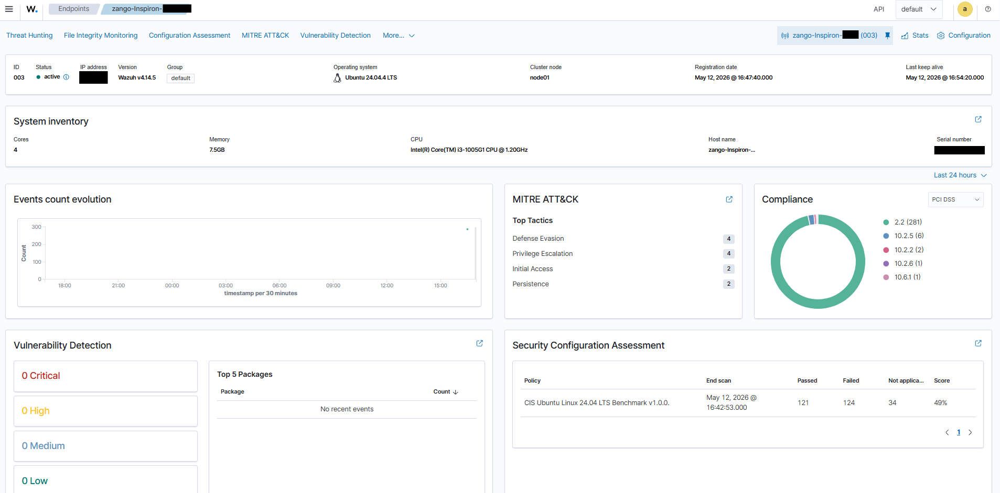
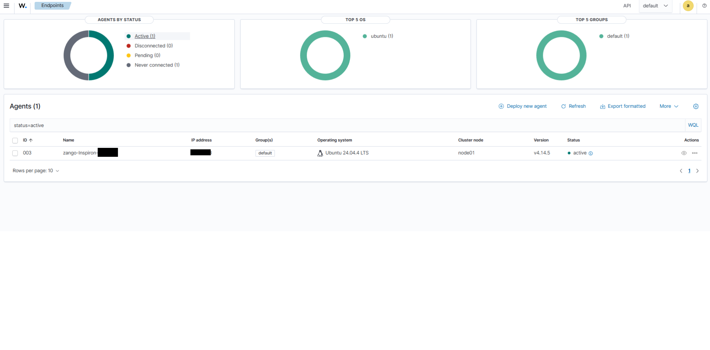

# Screenshots and Validation Evidence

This folder contains the screenshots used to document the Wazuh home lab setup and validation workflow. Each image shows a specific part of the environment setup, endpoint health, or SIEM platform status.

---

## 1. Endpoint Validation

### `auditd active on endpoint.png`

Shows that the Linux audit daemon is running on the Ubuntu endpoint, confirming that host-level auditing and event logging are enabled.

### `Endpoint Information.png`

Displays endpoint metadata such as hostname, OS, and hardware details used to verify that the monitored host is correctly configured.

### `Ping Ubuntu Wazuh Server.png`

Confirms that the endpoint can reach the Wazuh server over the network.

### `Sysmon Running on endpoint.png`

Shows that Sysmon is active on the endpoint and collecting process and system telemetry.

### `Wazuh Agnet Running on Endpoint.png`

Confirms that the Wazuh agent is installed and running on the monitored Ubuntu host and is actively forwarding data to the server.

### `Ubuntu_Laptop_Overview.png`

Provides a high-level overview of the Ubuntu endpoint connected to the Wazuh SIEM environment.

### `Ubuntu_Laptop_Overview_2.png`

Shows the endpoint connected to the environment and confirms that it is the active monitored client in the lab.

### `Ubuntu Agent Logs.png`

Shows logs generated on the Ubuntu endpoint that are visible in the Wazuh dashboard.

---

## 2. Server Validation

### `Available Storage on Server.jpg`

Displays the available disk space on the Wazuh server, confirming the server has sufficient storage for logs and indexing.

### `Ram on Server.jpg`

Shows the memory usage and available RAM on the Wazuh server.

### `Server Host Information.png`

Displays the server hostname and operating details, confirming the identity and configuration of the SIEM host.

### `IP of Wazuh Server.png`

Shows the Wazuh server's IP address and confirms the server is reachable on the network.

---

## 3. Wazuh Platform Status

### `Wazuh Agents Section.png`

Shows the enrolled Wazuh agents in the server environment and confirms the endpoint is connected to the manager.

### `Wazuh Dashboard Active.jpg`

Confirms that the Wazuh dashboard service is active and running.

### `Wazuh Dashboard.png`

Shows the main Wazuh dashboard interface and the overall monitoring overview.

### `Wazuh Indexer Active.jpg`

Shows that the Wazuh indexer service is active and functional.

### `Wazuh Login Page.png`

Shows the Wazuh login page used to access the dashboard.

### `Wazuh Manager Active.png`

Confirms that the Wazuh manager service is active and the SIEM backend is running properly.

---

## 4. Summary

These screenshots document the major validation steps for the home SIEM lab:

- endpoint connectivity and health checks
- host monitoring tools such as auditd and Sysmon
- Wazuh agent registration and log forwarding
- server resource validation
- Wazuh manager, indexer, and dashboard operational status

Together, they provide visual evidence that the SIEM stack is functioning as intended and that the monitored endpoint is successfully reporting into the environment.
